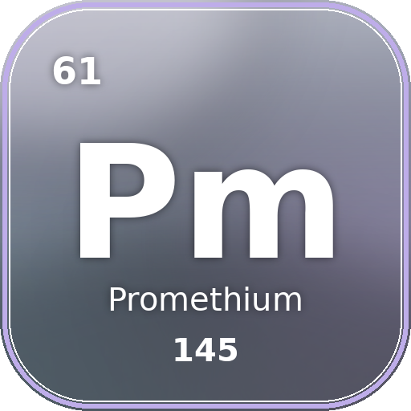

<div align="center">



# Pm钷

**ClassIsland 综合增强插件**

*从多个角度把 ClassIsland 变得更好用 —— 小到一个动作，大到一整块界面。*

</div>

---

## 状态

🚧 早期开发中，功能清单待定。

## 环境

- ClassIsland 2.0.0.1 ~ 2.1.x（API 版本 `2.0.0.0`）
- .NET 8 SDK

## 构建

```bash
dotnet build src/ClassIsland.Promethium/ClassIsland.Promethium.csproj -c Release
```

## 许可

[MIT](LICENSE) © 2026 秋夕月拾旧
